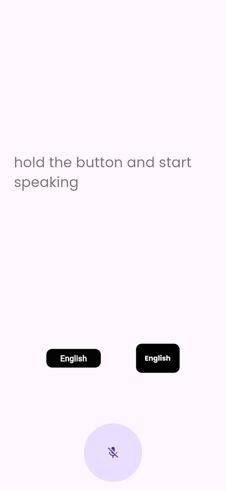
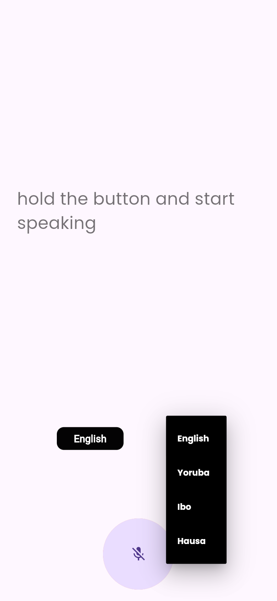

# Voice Translator (English · Yoruba · Igbo · Hausa)

**A push-to-talk Flutter app that turns your speech into text and translates it into Nigerian languages using Microsoft Azure Translator.**


## Screenshots

<table>
  <tr>
    <td align="center"><br><sub>Hold the mic to speak</sub></td>
    <td align="center"><br><sub>Choose the target language</sub></td>
  </tr>
</table>

## Features

- **Push-to-talk speech recognition:** hold the mic button to speak and release to stop (`speech_to_text`).
- **Live translation:** recognised words are sent to the **Azure Cognitive Services Translator** REST API (v3.0) and the translated text replaces the transcript.
- **Nigerian languages:** translate into **English, Yoruba, Igbo or Hausa**.
- **Re-translate on the fly:** switching the target language re-translates the current text.
- **Animated feedback:** a glowing mic animation (`avatar_glow`) shows while listening.

## Tech stack

| Area | Tools |
|---|---|
| Framework | Flutter, Dart 3 |
| Speech | `speech_to_text` |
| Translation | Azure Translator REST API via `http` |
| UI | `avatar_glow`, `google_fonts` (Poppins) |

## Project structure

```
lib/
├── main.dart        # App entry
└── mainscreen.dart  # Mic button, speech capture, translation calls, language picker
```

## Getting started

1. Create a **Translator** resource in the [Azure portal](https://portal.azure.com) and copy its key.
2. Run the app, passing the key at build time (it is never stored in the source code):

```bash
git clone https://github.com/Mickool17/translator.git
cd translator
flutter pub get
flutter run --dart-define=AZURE_TRANSLATOR_KEY=<your-azure-key>
```

Speech recognition needs a real device or emulator with microphone access (Android / iOS).

## Author

Built by [@Mickool17](https://github.com/Mickool17)
